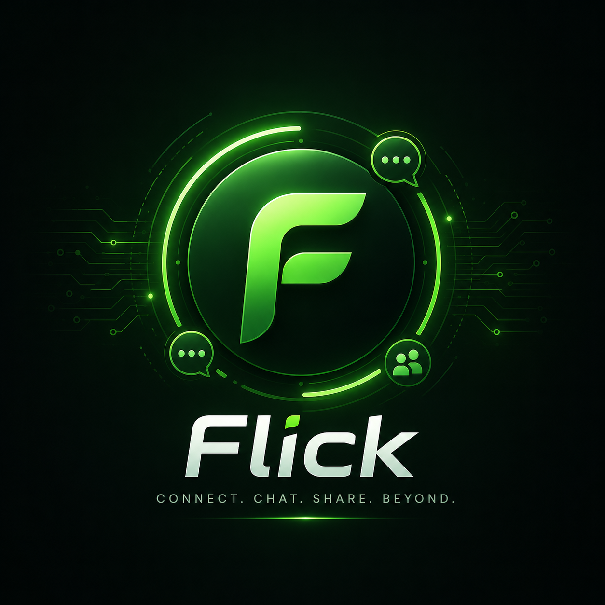

# 🚀 Flick

<p align="center">
  
</p>

<h1 align="center">Flick</h1>

<p align="center">
<b>Connect • Chat • Share • Beyond</b><br>
A next-generation social messaging platform built for real-time communication, immersive communities, and AI-powered experiences.
</p>

<p align="center">


</p>

---

# ✨ Overview

Flick is an all-in-one communication platform developed by **FaraTech** that combines modern messaging, social networking, AI-powered discovery, and real-time communities into a single experience.

## Highlights

- 💬 Realtime Messaging
- 👥 Groups & Communities
- ❤️ Social Feed
- 📸 Stories
- 📹 Reels (Roadmap)
- 🔔 Native Push Notifications
- 🤖 AI Features
- 🌐 Progressive Web App
- 📱 Android APK
- 💻 Desktop Support
- 🔒 Privacy-first Architecture

---

# 📸 Screenshots

> Replace these placeholders with actual screenshots.

| Feed | Chat |
|------|------|
| docs/feed.png | docs/chat.png |

| Stories | Groups |
|----------|--------|
| docs/stories.png | docs/groups.png |

---

# 📋 Feature Matrix

| Feature | Status |
|---------|:------:|
| Private Messaging | ✅ |
| Group Chats | ✅ |
| Stories | 🚧 |
| Social Feed | ✅ |
| Push Notifications | ✅ |
| AI Recommendations | 🚧 |
| Voice Calls | 🗺️ Planned |
| Video Calls | 🗺️ Planned |
| Desktop | ✅ |
| Android | ✅ |
| Web | ✅ |

---

# 🏗 Architecture

```text
React UI
   │
State Management
   │
Messaging • Feed • Stories
   │
Firebase
Firestore • Auth • Storage
   │
Cloud Functions
   │
OneSignal Push
   │
Android • Desktop • Web
```

---

# 🧰 Tech Stack

## Frontend
- React 19
- TypeScript
- Tailwind CSS
- Framer Motion

## Backend
- Firebase Authentication
- Firestore
- Cloud Functions
- Firebase Storage

## Native
- Capacitor
- OneSignal
- Android

## Additional
- Cloudinary
- Three.js
- Gemini AI

---

# 🎨 Design Philosophy

- Brutalism
- Neumorphism
- Claymorphism
- Glassmorphism
- Cyberpunk aesthetics
- Fluid micro-interactions
- Smooth animations
- Accessible UI

---

# ⚡ Performance Goals

- Fast startup
- Lazy loading
- Efficient caching
- Minimal re-renders
- Smooth 60 FPS animations
- Low bandwidth usage

---

# 🔐 Security

- Secure Authentication
- HTTPS
- Firestore Security Rules
- Cloud Functions validation
- AI moderation
- Spam protection

---

# 📂 Project Structure

```text
flick/
├── android/
├── public/
├── src/
│   ├── assets/
│   ├── components/
│   ├── firebase/
│   ├── hooks/
│   ├── pages/
│   ├── services/
│   ├── store/
│   └── utils/
├── functions/
└── README.md
```

---

# 🚀 Installation

```bash
git clone https://github.com/YOUR_USERNAME/flick.git
cd flick
npm install
npm run dev
```

Production build:

```bash
npm run build
```

---

# 🌍 Environment Variables

```env
VITE_FIREBASE_API_KEY=
VITE_FIREBASE_AUTH_DOMAIN=
VITE_FIREBASE_PROJECT_ID=
VITE_FIREBASE_STORAGE_BUCKET=
VITE_FIREBASE_MESSAGING_SENDER_ID=
VITE_FIREBASE_APP_ID=
VITE_ONESIGNAL_APP_ID=
```

---

# 🛣 Roadmap

## Version 1
- Messaging
- Groups
- Feed
- Push Notifications

## Version 2
- Stories
- Voice Calls
- Video Calls
- Media Optimization

## Version 3
- AI Personalization
- Creator Tools
- Business Profiles
- Monetization

---

# 🤝 Contributing

1. Fork the repository
2. Create a feature branch
3. Commit changes
4. Open a Pull Request

---

# 📜 License

MIT License

---

# ❤️ Built by FaraTech

Building technology that empowers communication, education, and digital communities.

---

<p align="center">
<b>Flick — The Future of Social Communication.</b>

Made with ❤️ by FaraTech.
</p>
